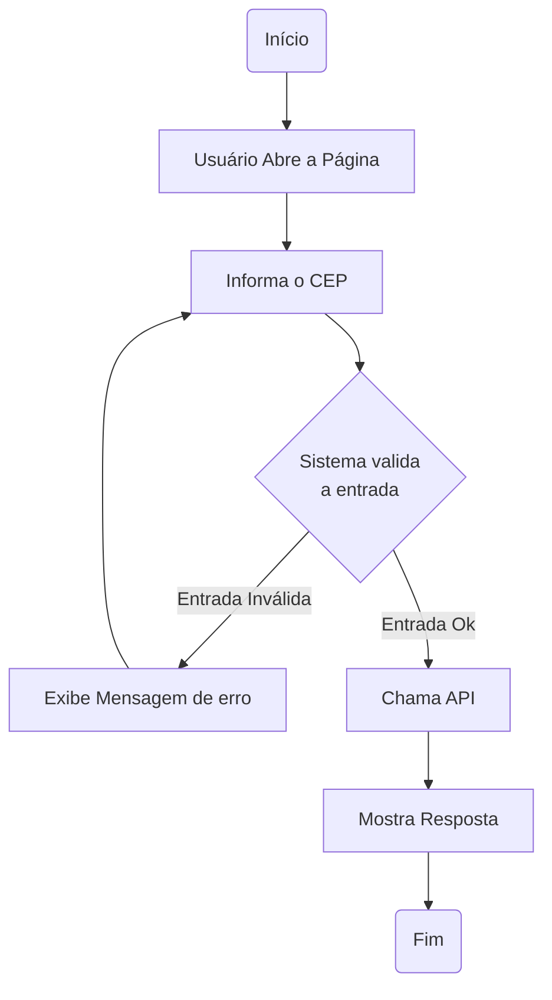

# Busca CEP

Aplicação desenvolvida com HTML, CSS e JavaScript puro para consulta de CEPs utilizando uma API pública.

> Projeto desenvolvido como parte da construção do meu portfólio e dos estudos de arquitetura de software.

O objetivo é criar uma aplicação que receba a informação de um CEP, faça a chamada na API e exiba o endereço correspondente na tela. 

## O que estou exercitando?

Estou exercicitando a capacidade de arquitetar o projeto, pensar em fluxos, responsabilidades e quem/ o que delegar.

## Requisitos

### Funcionais

|Código|Requisito|
|:---:|---|
|RF01|Exibe CEP, logradouro, complemento, bairro, localidade, UF, Estado em campos separados|
|RF02|Usuário pode fazer várias consultas, uma por vez!
|RF03|O sistema exibirá uma mensagem de notificação de erro caso a entrada seja inválida ou o cep seja inexistente|
|RF04|Deve ter botão que copia o texto completo dos dados do endereço pesquisado para a área de transferência do usuário|
|RF05|Deve ter botão de limpeza dos dados|

### Não Funcionais

|Código|Requisito|
|:---:|---|
|RNF01|Sistema será ser responsivo, tanto para mobile quanto para telas maiores|
|RNF02|Rodar em todos os navegadores modernos|
|RNF03|O botão pesquisar deve ficar inativo até a resposta da requisição seja concluída, de forma a impedir que o usuário inicie múltiplas consultas simultaneamente|
|RNF04|O sistema apresentar os dados em estilo formulário cada dado em um campo|

## Responsabilidades

- Recebero CEP informado pelo usuário
- Validar o CEP informado
- Consular o serviço de CEP
- Exibir o endereço encontrado
- Exibir mensagem de erro ou sucesso
- Permitr copiar o endereço
- Permitir limpar a consulta

---

## Fluxo

---