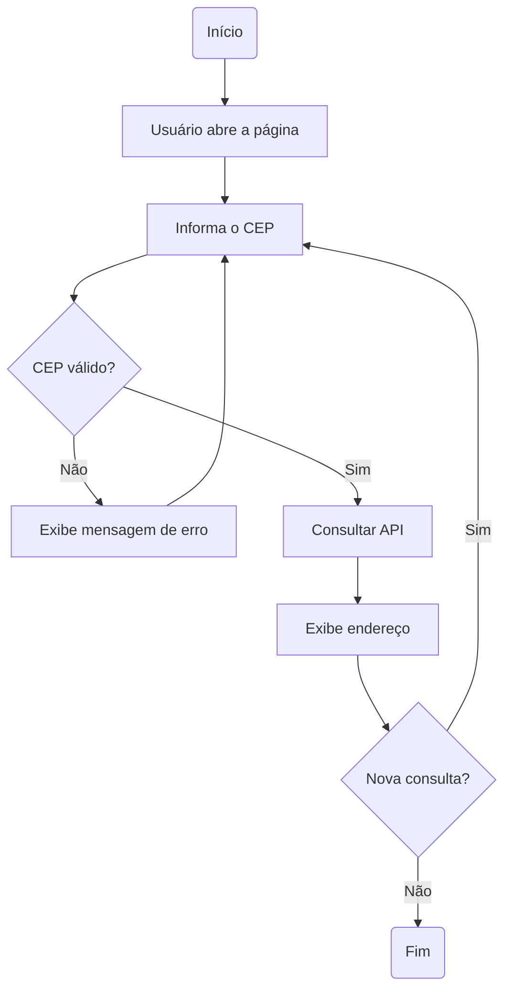

# Análise do Projeto - Busca CEP

## Objetivo

Desenvolver uma aplicação web capaz de consultar um endereço a partir de um CEP brasileiro informado pelo usuário.

Além da implementação, este projeto tem como objetivo praticar análise de requisitos, arquitetura de software e boas práticas de organização do código.

---

# 1. Levantamento de Requisitos

## Necessidades identificadas

- O usuário informa um CEP brasileiro e recebe o endereço correspondente.
- O sistema não realizará busca por endereço.
- Os dados serão exibidos em campos separados.
- O usuário poderá realizar várias consultas sem recarregar a página.
- Não haverá autenticação.
- Não haverá histórico de consultas.
- A aplicação deverá funcionar tanto em desktop quanto em dispositivos móveis.

---

# 2. Requisitos

## Requisitos Funcionais

| Código | Descrição |
|:------:|-----------|
| RF01 | Consultar um CEP brasileiro. |
| RF02 | Exibir logradouro, complemento, bairro, cidade, UF e estado em campos separados. |
| RF03 | Permitir múltiplas consultas durante a mesma utilização da página. |
| RF04 | Exibir mensagens amigáveis para CEP inválido ou inexistente. |
| RF05 | Permitir copiar o endereço completo para a área de transferência. |
| RF06 | Permitir limpar os dados da consulta. |

## Requisitos Não Funcionais

| Código | Descrição |
|:------:|-----------|
| RNF01 | A aplicação deve ser responsiva. |
| RNF02 | Deve funcionar nos principais navegadores modernos. |
| RNF03 | O botão "Buscar" permanecerá desabilitado durante a consulta da API. |
| RNF04 | Os dados serão apresentados em formato de formulário. |

---

# 3. Responsabilidades

Durante a análise foram identificadas as seguintes responsabilidades:

- Receber o CEP informado.
- Validar o CEP.
- Consultar o serviço de CEP.
- Exibir o endereço encontrado.
- Exibir mensagens ao usuário.
- Permitir copiar o endereço.
- Limpar os dados da consulta.

---

# 4. Fluxo da Aplicação



---

# 5. Decisões Arquiteturais

## Responsabilidades da Interface

- Receber o CEP.
- Exibir endereço.
- Exibir mensagens.
- Limpar os campos.
- Copiar o endereço.

## Responsabilidades do Service

- Consultar a API de CEP.

## Responsabilidades do Util

- Validar o CEP informado.

---

# 6. Estrutura Inicial do Projeto

```text
busca-cep/
│
├── docs/
│   └── analise.md
│
├── css/
│   └── style.css
│
├── js/
│   ├── main.js
│   ├── services/
│   │   └── cepService.js
│   └── utils/
│       └── validarCep.js
│
├── index.html
├── README.md
└── .gitignore
```